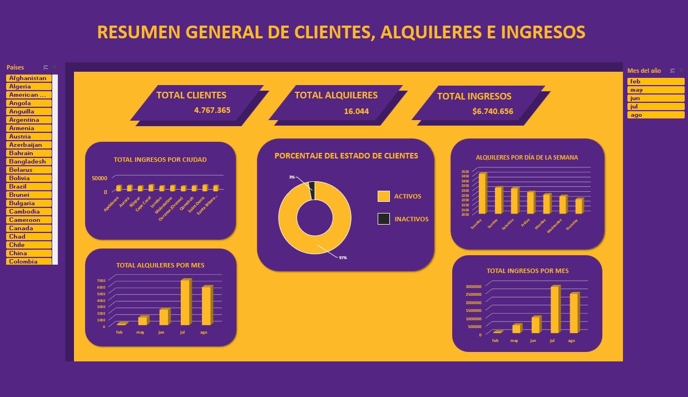

# 📊 Sakila Automation Project

Automatización de datos desde MySQL hacia Python y Excel, con dashboard analítico interactivo basado en el dataset generado.

---

## 🧾 Descripción

Este proyecto implementa un **pipeline de datos automatizado** que:

1. Extrae datos desde una base de datos MySQL (Sakila).
2. Los transforma con Python y Pandas.
3. Genera un archivo CSV.
4. Alimenta un **dashboard en Excel** con tablas dinámicas y gráficos.

El objetivo principal es ilustrar un flujo completo de ETL (Extracción, Transformación, Carga), junto a visualización de información para la toma de decisiones.

---

## 👥 Equipo de trabajo

| Rol | Nombre |
|-----|--------|
| **Product Owner** | Pablo Rodríguez Muñoz |
| **Data Analyst** | Samuel Pérez Delgado|
| **Scrum Master** | Francisco Manuel rodríguez Martín|

---

## 🎯 Objetivos

- Automatizar la extracción de datos desde MySQL.
- Procesar y transformar datos con Python.
- Generar un dataset CSV preprocesado.
- Vincular automáticamente el CSV con un archivo de Excel.
- Crear un dashboard que permita analizar tendencias y patrones de negocio.

---

## 🗄️ Base de datos

Este proyecto utiliza la base de datos de ejemplo **Sakila** en MySQL, la cual contiene información estructurada de una tienda de alquiler de películas:

- Clientes
- Direcciones, ciudades y países
- Alquileres y pagos

Esta base de datos es ampliamente utilizada para aprendizaje y prácticas de SQL y modelado de datos.

---

## 🔄 Arquitectura del proyecto

El proyecto está dividido en módulos que separan claramente la lógica de extracción, transformación y visualización:
```
proyecto-sakila-automation/
│
├── main.py # Punto de entrada principal
│
├── src/ # Código fuente para el procesamiento
│ ├── init.py
│ ├── config.py # Configuración de variables de entorno
│ └── sakila_ETL.py # Extracción y transformación de datos
│
├── output/ # Datos de salida
│ └── datos_sakila.csv # CSV final generado
│
├── images/
│ └── captura_dashboard.jpg
│
├── dashboard/ # Visualización
│ └── Dashboard_sakila.xlsx # Dashboard en Excel
│
├── requirements.txt # Dependencias del proyecto
├── .env # Variables de entorno (no se sube a Git)
├── .env.example # Plantilla de variables de entorno
├── .gitignore
└── README.md # Documentación del proyecto
```

---

## 🚀 Ejecución del proyecto

1. Clonar el repositorio:
```bash
git clone https://github.com/PabloRodMu/Proyecto-Automatizaci-n-ETL-Sakila-Dashboard.git

---

python -m venv venv
source venv/bin/activate        # Linux / macOS
venv\Scripts\activate           # Windows

---

pip install -r requirements.txt
```
### Configurar las variables de entorno

1. Copiar el archivo `.env.example`
2. Renombrarlo a `.env`
3. Completar los valores de conexión a la base de datos

### Ejecutar el pipeline

```bash
python main.py
```
## 📊 Dashboard de Excel

El dashboard permite analizar de forma interactiva los datos procesados mediante:

### KPIs principales
- Total de ingresos
- Total de alquileres
- Total de clientes

### Visualizaciones incluidas
- Ingresos por ciudad
- Alquileres por mes
- Ingresos por mes
- Alquileres por día de la semana
- Distribución de clientes activos vs inactivos (gráfico de anillo)

### Segmentadores
- País
- Mes del año

Estas visualizaciones permiten identificar patrones de consumo, tendencias temporales y la distribución geográfica de los ingresos.

---

## 🔒 Seguridad

Las credenciales de la base de datos se gestionan mediante variables de entorno y **no se suben al repositorio**.  
El archivo `.env` está correctamente incluido en `.gitignore`.

---

## 👥 Contexto del proyecto

Proyecto desarrollado en equipo como parte de un **bootcamp de Data Analyst**, con foco en:

- Automatización de flujos de datos
- Extracción y transformación de información
- Análisis exploratorio de datos
- Visualización y dashboards en Excel

---

## 📌 Posibles mejoras futuras

- Automatizar la actualización del dashboard desde Python
- Migrar la visualización a Power BI u otras herramientas BI
- Incorporar validaciones y control de calidad de datos
- Añadir logging y manejo avanzado de errores
- Implementar tests automatizados

---

## 🧑‍💻 Contribuciones

Las contribuciones son bienvenidas.  
Si deseas mejorar este proyecto, puedes abrir un *issue* o enviar un *pull request*.

---
## 📷 Vista Previa



---

## 📜 Licencia

Este proyecto fue desarrollado con fines educativos como parte de un bootcamp.
